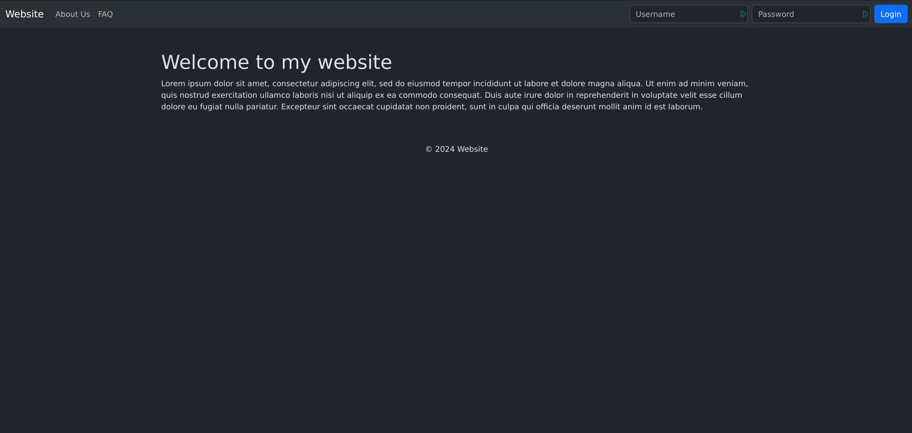

# Bootstrap Example

For this example I used ExpressJS (ran with nodemon for hot-reload) for the server and which is written in Typescript.
Bootstrap is installed with `npm` and stored in the `node_modules` folder.
Inside `src/` is where you'll find `index.html`

## Preview

